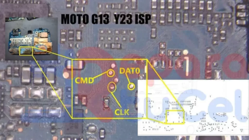

# UFS ISP PinOUT | Test Point

## Testpoint image

## Guide:

1. First, take your phone’s back cover off. Then, remove the battery, fingerprint reader, and camera from the motherboard.
2. Unscrew the screws that hold the motherboard in place, carefully remove it, and put it in a safe place.
3. Find the TxOp, TxOn, RxOp, and RxOn pins for the eMMC on the device. You might have to cut through the steel cover to get to them.
4. Get the UFI box, then take the adapter out of it. The pins on the adapter should be the same as the ones listed in the last step.
5. Between the base and the adapter, use jumpers to connect the four pins (TxOp, TxOn, RxOp, and RxOn). Leave the USB to power the VCC and VCCQ.
6. Put the connector into the UFI box and connect the box to your computer.
7. Connect the battery to the computer again. Then, connect the phone to your computer using the USB connection.

## Required:
- Motorola Moto G13 with Good Charge Battery
- Easy Jtag box with adapter
- Micro USB Cable
- Computer or Laptop

## Motorola Moto G13 FRP Lock Using EasyJTAG Plus:
- Remove the device’s back panel and connect the wire to the UFS ISP Pinout.
- Next, connect the correct UFS ISP Pinout to the EasyJTAG Plus box
- Check the “UFS” tab
- Then Click on “Identify UFS Chip.
- Connect your Motorola Moto G13 to the PC via a USB cable.
- Go to Preset Select Persistent
- Now Click on Erase LUN0 Data

_Details: [www.mobilerdx.com](https://www.mobilerdx.com/2024/08/motorola-moto-g13-ufs-isp-pinout.html#google_vignette)_